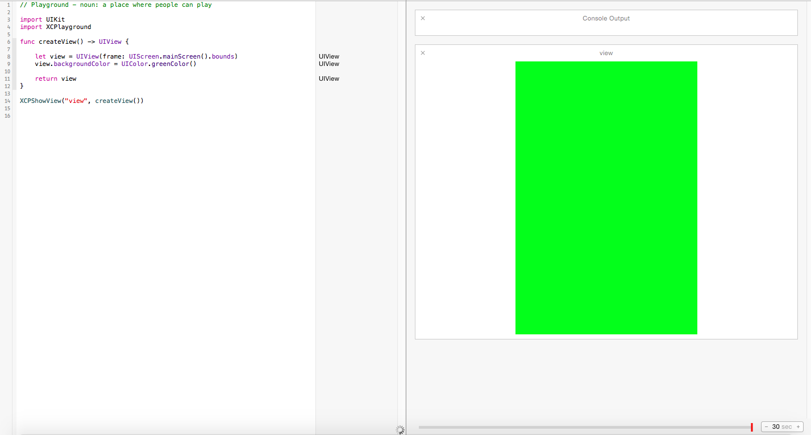
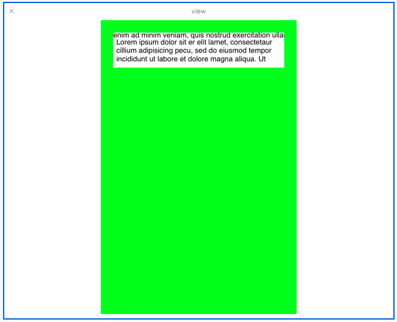
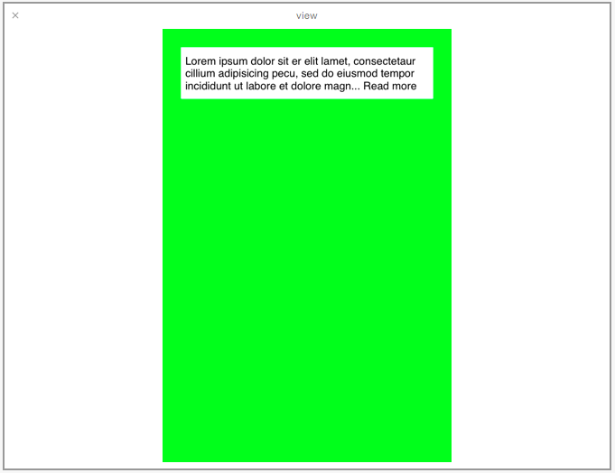

In this article I want to describe how I developed custom UITextView component in Swift using TextKit, Playgrounds and IBDesignable and IBInspectable directives. You can check out source code on [github](https://github.com/ilyapuchka/ReadMoreTextView).

<!-- description -->

In this component we will add "read more" behaviour to text view. It will have two modes - full mode and trimmed mode. In full mode it will behave like standard UITextView. In trimmed mode it will trim text to some maximum numbers of lines and trim text with a string (like "Read more"). When user taps on "Read more" the component will switch from trimmed mode to full mode.

#### Creating playgroud

As I said earlier we will develop this component directly in Swift Playgroud. In Playgrouds we can render any view in Assistant Editor with help of XCPlayground module and it's XCPShowView function. To make it work we need to open playground's File Inspector (⌥-⌘-1). In File Inspector in Playground Settings we should check "Run in Full Simulator". Now hide File Inspector (⌥-⌘-0) and open Assistant Editor (⌥-⌘-⏎).


Recently I wrote [a small overview](http://ilya.puchka.me/quick-overview-of-swift-playgrounds-in-ios-simulator/%22) about using this feature of playgrounds.

#### Creating main view

To display something in Assistant Editor we will create a main view. Let's define a function that will create and return this view.

```swift
func createView() -> UIView {
    let view = UIView(frame: UIScreen.mainScreen().bounds)
    view.backgroundColor = UIColor.greenColor()
    return view
}
```

Now we can display this view in Assistant Editor:

```swift
import UIKit
import XCPlayground

func createView() -> UIView {
...
}

XCPShowView("view", createView())
```

Here is what you should see:



#### Component's interface

As mentioned earlier we want our component to have maximum number of lines in trimmed mode and a string to trim text. Also we will add a flag to turn trimming on and off. So let's define some basic interface for our component:

```swift
class ReadMoreTextView: UITextView {

    var maximumNumberOfLines: Int = 0
    var trimText: NSString?
    var shouldTrim: Bool = false

}
```

Changing any of these properties should cause our text view to update it's layout so we need to add property observers for them:

```swift
var maximumNumberOfLines: Int = 0 {
    didSet { setNeedsLayout() }
}

var trimText: NSString? {
    didSet { setNeedsLayout() }
}

var shouldTrim: Bool = false {
    didSet { setNeedsLayout() }
}

func needsTrim() -> Bool {
    return shouldTrim && trimText != nil
}

override func layoutSubviews() {
    super.layoutSubviews()
    needsTrim() ? updateText() : resetText()
}

func updateText() {
    //update text view
}

func resetText() {
    //reset text view
}
```

#### Adding component to main view

To continue we need to see how our text view is rendered so we need to add it to our main view that is displayed in Assistant Editor. We can modify `createView` function to accept text view as it's argument and to add it on screen:

```swift
func createView(textView: TextView) -> UIView {

    let view = UIView(frame: UIScreen.mainScreen().bounds)
    view.backgroundColor = UIColor.greenColor()
    view.addSubview(textView)
    let metrics = ["padding": 20]

    view.addConstraints(NSLayoutConstraint
        .constraintsWithVisualFormat("V:|-padding-[textView]-padding-|", options: nil,
            metrics: metrics,
            views: ["textView": textView]))

    view.addConstraints(NSLayoutConstraint
    .constraintsWithVisualFormat("H:|-padding-[textView]-padding-|", options: nil,
        metrics: metrics,
        views: ["textView": textView]))

    return view
}

let textView = ReadMoreTextView()

textView.text = "Lorem ipsum dolor sit er elit lamet, consectetaur cillium adipisicing pecu, sed do eiusmod tempor incididunt ut labore et dolore magna aliqua. Ut enim ad minim veniam, quis nostrud exercitation ullamco laboris nisi ut aliquip ex ea commodo consequat. Duis aute irure dolor in reprehenderit in voluptate velit esse cillum dolore eu fugiat nulla pariatur. Excepteur sint occaecat cupidatat non proident, sunt in culpa qui officia deserunt mollit anim id est laborum. Nam liber te conscient to factor tum poen legum odioque civiuda."

textView.maximumNumberOfLines = 3
textView.shouldTrim = true
textView.trimText = "Read more"

XCPShowView("view", createView(textView))
```

#### Extending TextKit

To trim text we need first find the range of text that fits to `maximumNumberOfLines`. To do so we will use TextKit. UITextView already uses it to render it's text on screen and has built in components like text container, text storage and layout manager. I will not go through details of TextKit, for more details on TextKit check out [objc.io](http://www.objc.io/issue-5/getting-to-know-textkit.html) or [documentation](https://developer.apple.com/library/ios/documentation/StringsTextFonts/Conceptual/TextAndWebiPhoneOS/CustomTextProcessing/CustomTextProcessing.html).

In NSLayoutManager's extention we will define two simple helper functions: first to find characters range that fits in text container and second to find bounding rectangle of characters range:

```swift
extension NSLayoutManager {

    func characterRangeThatFits(textContainer: NSTextContainer) -> NSRange {
        var rangeThatFits = self.glyphRangeForTextContainer(textContainer)
        rangeThatFits = self.characterRangeForGlyphRange(rangeThatFits, actualGlyphRange: nil)
        return rangeThatFits
    }

    func boundingRectForCharacterRange(range: NSRange, inTextContainer textContainer: NSTextContainer) -> CGRect {
        let glyphRange = self.glyphRangeForCharacterRange(range, actualCharacterRange: nil)
        let boundingRect = self.boundingRectForGlyphRange(glyphRange, inTextContainer: textContainer)
        return boundingRect
    }
}
```

#### Trimming text

Before updating text and trimming it we need to make sure that we can restore text view to it's full state when text should not be trimmed. For that we will store text and attributed text in private properties:

```swift
private var originalText: String!

override var text: String! {
    didSet {
        originalText = text
        originalAttributedText = nil
        if needsTrim() { updateText() }
    }
}

private var originalAttributedText: NSAttributedString!

override var attributedText: NSAttributedString! {
    didSet {
        originalAttributedText = attributedText
        originalText = nil
        if needsTrim() { updateText() }
    }
}
```

When we does not need to trim text we reset text view to full mode and restore it's text:

```swift
func resetText() {
    textContainer.maximumNumberOfLines = 0
    if originalText != nil {
        textStorage.replaceCharactersInRange(NSMakeRange(0, countElements(text!)), withString: originalText)
    }
    else if originalAttributedText != nil {
        textStorage.replaceCharactersInRange(NSMakeRange(0, countElements(text!)), withAttributedString: originalAttributedText)
    }
}
```

Next we add function to find range of text to replace with "Read more":

```swift
private func rangeToReplaceWithTrimText() -> NSRange {
    let emptyRange = NSMakeRange(NSNotFound, 0)

    var rangeToReplace = layoutManager.characterRangeThatFits(textContainer)
    if NSMaxRange(rangeToReplace) == originalTextLength() {
        rangeToReplace = emptyRange
    }
    else {
        rangeToReplace.location = NSMaxRange(rangeToReplace) - trimText!.length - 4
        if rangeToReplace.location < 0 {
            rangeToReplace = emptyRange
        }
        else {
            rangeToReplace.length = textStorage.length - rangeToReplace.location
        }
    }
    return rangeToReplace
}

private var _originalTextLength: Int {
    get {
        if originalText != nil {
            return countElements(originalText!)
        }
        else if originalAttributedText != nil {
            return originalAttributedText!.length
        }
        return 0
    }
}
```

Here we increase range by 4 to be able to add "... " as a prefix for trim text later. If we don't need to trim text eigther if we have too small text or too big `maximumNumberOfLines` then we return empty range.

Finally let's add code that will trim text:

```swift
func updateText() {
    textContainer.maximumNumberOfLines = maximumNumberOfLines
    layoutManager.invalidateLayoutForCharacterRange(layoutManager.characterRangeThatFits(textContainer), actualCharacterRange: nil)
    textContainer.size = CGSizeMake(bounds.size.width, CGFloat.max)

    var range = rangeToReplaceWithTrimText()
    if range.location != NSNotFound {
        textStorage.replaceCharactersInRange(range, withString: "... ".stringByAppendingString(trimText!))
    }
    invalidateIntrinsicContentSize()
}
```

First we set maximum number of lines in text container and it's size so that bounding rectange of this text container will have the width of text view and unlimited height. We also have to invalidate layout information to properly calculate the range of text to trim. Then we find the range that we should replace with "Read more" text and if it's not empty we replace text in this range with `trimText` prefixed by "... "

#### Autolayout

When text view is in trim mode it needs to wrap it's content and become smaller than in full mode. To do so we need to redefine it's intrinsic content size.

```swift
override func intrinsicContentSize() -> CGSize {
    textContainer.size = CGSizeMake(bounds.size.width, CGFloat.max)
    var intrinsicContentSize = layoutManager.boundingRectForGlyphRange(layoutManager.glyphRangeForTextContainer(textContainer), inTextContainer: textContainer).size
    intrinsicContentSize.width = UIViewNoIntrinsicMetric
    intrinsicContentSize.height += (textContainerInset.top + textContainerInset.bottom)
    return intrinsicContentSize
}
```

First we set text container's size, again unlimited by height, then we find bounding rect for all text in this text container and take it's size. We don't need intrinsic size on width, so we set it to `UIViewNoIntrinsicMetric`. And we increase height by top and bottom insets of text container.

Aslo we need to update vertical constraints in `createView` and invalidate intrinsic size:

```swift
func updateText() {
    ...
    invalidateIntrinsicContentSize()
}

func resetText() {
    ...
    invalidateIntrinsicContentSize()
}

...

func createView(textView: UITextView) -> UIView {
    ...
    view.addConstraints(NSLayoutConstraint
        .constraintsWithVisualFormat("V:|-padding-[textView]-(>=padding)-|",
            options: nil,
            metrics: metrics,
            views: ["textView": textView]))
    ...
}
```

#### Initialization

Though we've done everything we need to make our text view work properly if you look now in Assistant Editor you will probably see something like this:



This is defenetly not what we want. It turns out that to fix that we need to disable scrolling and editing in our text view.  
Now everything should work as expected and you should see something like this:



#### Handling taps

Next we want our text view to switch it's state to full mode if we tap on "Read more" text. To do that we can check the point we tapped in `hitTest` function and reset to full mode if we need.

We need a function that will check if point is in range of `trimText`:

```swift
var trimTextRangePadding: UIEdgeInsets = UIEdgeInsetsZero

private func pointInTrimTextRange(point: CGPoint) -> Bool {
    let offset = CGPointMake(textContainerInset.left, textContainerInset.top)
    var boundingRect = layoutManager.boundingRectForCharacterRange(trimTextRange(), inTextContainer: textContainer, textContainerOffset: offset)
    boundingRect = CGRectOffset(boundingRect, textContainerInset.left, textContainerInset.top)
    boundingRect = CGRectInset(boundingRect, -(trimTextRangePadding.left + trimTextRangePadding.right), -(trimTextRangePadding.top + trimTextRangePadding.bottom))
    return CGRectContainsPoint(boundingRect, point)
}
```

Here we use a new property to define padding around `trimText` bounding rect in which we will handle taps.

Now we can implement our `hitTest` function:

```swift
public override func touchesEnded(touches: Set<UITouch>, withEvent event: UIEvent?) {
    guard let point = touches.first?.locationInView(self) else { return }

    if needsTrim() && pointInTrimTextRange(point) {
        maximumNumberOfLines = 0
        shouldTrim = false
    }
}
```

> Note: originally I've made a mistake doing that in `hitTest` method. The thing is that this method may be called by the system several times during handling of a single touch event. Thus this method should not have any side effects.

#### Interface Builder

This is the easiest part 'cause all we need to make our component to update in Interface Builder and to set it's properties in Attributes Inspector is to add @IBDesignable and @IBInspectable directives. We don't need to define `prepareForInterfaceBuilder` 'cause when we change `maximumNumberOfLines` or other properties we make layout update.

```swift
@IBDesignable
class ReadMoreTextView: UITextView {

    @IBInspectable
    var maximumNumberOfLines: Int = 0

    @IBInspectable
    var trimText: NSString?

    @IBInspectable
    var shouldTrim: Bool = false

    ...
}
```

#### Conclusion

We have developed custom text view in Swift and we used TextKit functionality for that. You can easily extend this component to add for example attributed trim text property so user can customize it's appearance. Also you might see how it's possible to develop components just in playgrounds. After you finished you can move all the code of your component in separate source file and import it to your project. Thought playgrounds lack interactivity (i.e. you can not recieve touch events from Assistant Editor) and some times don't update fast still lots of things could be done just in playgrounds with no need to create and setup whole new project.

Source code for this article is available on [github](https://github.com/ilyapuchka/ReadMoreTextView).
